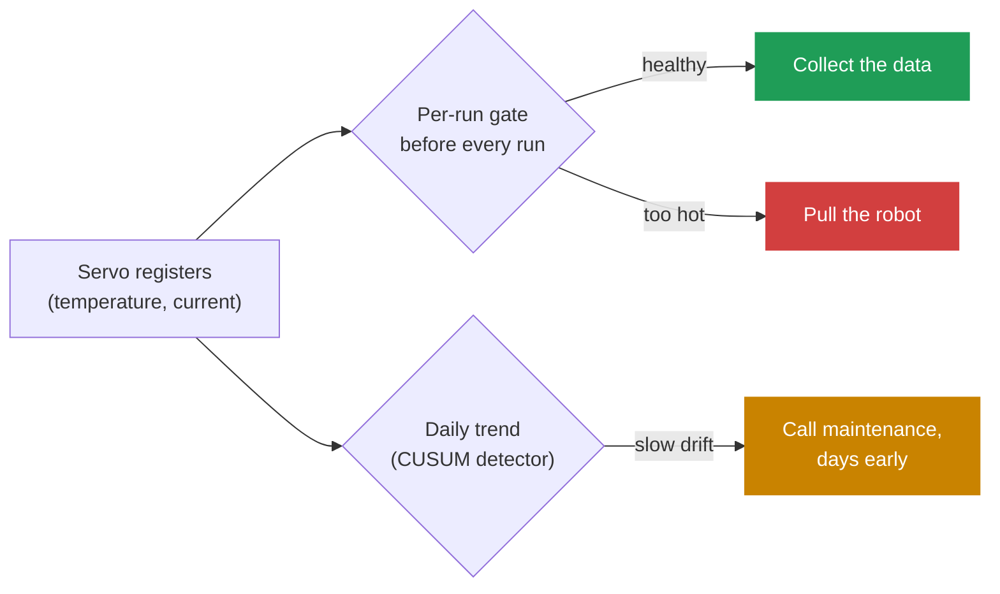

# robot-vitals

> **A health monitor for robot-learning fleets.** It catches when the robot, not the AI policy, is quietly corrupting the training data. And it only tests the hardware faults that actually matter.

**By Yash Prakash.** Live demo (runs in your browser, no install): **https://yash-prakash1.github.io/robot-vitals/**

[](https://yash-prakash1.github.io/robot-vitals/)
[](https://github.com/Yash-Prakash1/robot-vitals/tree/main/tests)


## In short

Robot-AI labs train foundation models on real robots, so the robot is the measurement instrument that produces the data. When a robot slowly overheats and degrades, the episodes it records are silently corrupted, and the AI policy gets blamed for what was actually a hardware problem. The published research that runs these robots around the clock documents this exact failure, an overheating drift after about 8 hours, and leaves the fix undefined: its own algorithm says "if robot unhealthy, notify operator," without ever defining "unhealthy."

**What I built.** The missing definition. A pre-flight health check that runs before every test run, plus a longitudinal layer that flags slow degradation weeks before it would fail a run. Both read sensors the robot already reports. No added hardware.

**The hard part, and the real point.** Deciding what is even worth testing. On a closed-loop robot the AI adapts to most hardware variation, so testing for it is noise. The centerpiece is an audit that filters the entire hardware list down to the few faults that genuinely corrupt data, with every cut documented and justified.

**Scanning this page? Jump to what you care about:**

| If you want to | Go to |
|---|---|
| see it run | the [live demo](https://yash-prakash1.github.io/robot-vitals/), or [Try it in 60 seconds](#try-it-in-60-seconds) below |
| see the judgment (what to test, what to skip, and why) | [The audit](#the-audit) |
| see the design decisions and reasoning | [Key decisions](#key-decisions-and-the-thinking-behind-them) |
| read the code | tested Python in `src/` (46 tests), the dashboard in `docs/` |

> [!TIP]
> Short on time? Open the **[live demo](https://yash-prakash1.github.io/robot-vitals/)** and click around. The text below is the reasoning behind it.

## How it works, at a glance



Same sensors, two timescales: block a bad run now, and catch the slow decline before it ever fails one.

## Try it in 60 seconds

Open the live demo: **https://yash-prakash1.github.io/robot-vitals/**

It is a guided tour that walks through the whole idea, scene by scene:

- **The cold open.** A motor slowly overheats while the AI eval score slides, and the policy gets blamed for a hardware fault. Documented, not hypothetical.
- **Watch one arm for 30 days.** A 3D WidowX arm stacks blocks while its servos glow by temperature. Scrub the month and watch two checks read the same sensors: a fast pre-flight gate before every run, and a patient daily trend. The trend notices the creep days before the gate does.
- **Make the call.** A run is queued, the arm passed its quick check, the trend already flagged it. Collect or pull? The reveal shows what each check knew, with the day numbers computed live.
- **The audit.** Run ten candidate faults through two filters (can the closed-loop policy compensate, and does it actually recur), and watch the list collapse to one proven fault plus one labeled candidate.
- **Break an arm yourself.** Pick a joint, a drift speed, and a start day. The gate keeps passing while the trend catches your fault, and the tool reports the lead time without inventing a failure date.
- **The whole fleet.** Eight arms, three with a planted fault: a slow thermal creep, an effort rise only the current channel sees, and an acute spike only the per-run gate catches. Click any arm to load its story.

Press **New simulation** in the fleet view to roll a fresh fleet in your browser, or open the dense **[engineer's grid view](https://yash-prakash1.github.io/robot-vitals/dashboard.html)** for the per-run, per-joint dashboard. The data is synthetic; the scoring, drift detection, and gate are the real logic, running live.

## The problem, in one minute

Robots here are not the product. They are the instrument that generates training data and runs policy evaluations. An uncalibrated instrument produces unpublishable science.

PI's own AutoEval paper (arXiv:2503.24278, CoRL 2025) documents the failure precisely: eval scores held steady for the first 350 episodes, then "a regression in performance after approximately 8 hours of continuous operation, which we attribute to an overheating of the motors of our rather affordable WidowX robot." The robot degraded, not the policy, and the score moved anyway. Its mitigation is a blunt timer (pause "20 minutes every 6 hours"), and its own Algorithm 1 contains the line this project completes:

> Failure: If unable to reset or robot unhealthy, notify human operator to help.

> [!IMPORTANT]
> **"Unhealthy" is never defined.** This project defines and detects it.

The blind spot is shared. AutoEval, PolaRiS (arXiv:2512.16881), and RoboArena (arXiv:2506.18123) all treat the physical robot, when used, as a trusted measurement device. None monitors its health. And the cost compounds: eval data is fed back into training tagged by quality, so a degraded robot's episodes, mislabeled as low-quality policy data, poison the next model.

## The core idea: test only what corrupts the data, not what varies

A dashboard that flags every hardware imperfection is the wrong instinct. These robots run closed-loop visuomotor policies: they look, see where the object actually is, and adapt. They are built to be robust to hardware variation, because that is the entire point of a foundation model. So:

- ✅ **Acceptable variation** (tilted camera, slightly imprecise arm, worn-in mechanics): the policy adapts. Do not test for it.
- ❌ **Data contamination** (a fault the policy cannot perceive or compensate for, that silently corrupts the episode): this breaks the science. Test for this.

Two filters make the cut precise:

- **Filter 1, compensability.** Does the closed-loop policy structurally fail to compensate? If it can see and adapt, the test is pointless.
- **Filter 2, frequency.** Does it actually recur on this hardware, given warranties, solid-state parts, and factory calibration? "I can imagine it" is not the bar.
- **Burden of proof is on inclusion.** The default is to not build a test. Every cut becomes a defensible "this has not earned a test," never an unprovable "this never happens."

## The audit

The centerpiece. Filtering the robot's full parts list against both filters leaves a deliberately small set.

| Candidate fault | Policy cannot compensate? | Actually occurs here? | Verdict |
|---|---|---|---|
| **Motor thermal** | Pass: a hot motor cannot deliver commanded torque, and no vision fixes a throttled actuator | Pass: AutoEval measured score regression from this, on this arm, in normal operation | ✅ **Core, proven** |
| **Motor effort drift** (wear) | Pass: a binding mechanism cannot execute commanded motion | Partial: the physics is certain, but the rate on these gears is unvalidated | 🟡 **Candidate, labeled** |
| Gripper pad wear | Partial: a slip is visible in the episode, far less silent than a throttled motor | Fail on frequency: not documented to wear on these foam and sorbothane pads | ❌ **Cut on frequency** (see below) |
| Encoder drift | Pass: corrupts the proprioceptive observation | Fail: contactless magnetic encoder has no wear surface; fails abruptly, not slowly | ❌ **Cut** |
| Comms bus health | Pass: dropped packets break the control loop | Fail: binary, not gradual; already handled in the stack | ❌ **Cut** |
| Gearbox backlash | Partial: closed-loop absorbs moderate backlash | Fail as a direct test: warrantied within cycle life. Caught via the effort channel | ❌ **Cut, folded into effort** |
| Supply voltage sag | Pass: motor cannot source torque the supply lacks | Partial: real but rare and usually noticed; a free register read | ➕ **Optional secondary read** |
| Camera position / tilt | Fail: a shifted view is exactly the variation the policy should handle | (moot) | ❌ **Cut** |
| Depth-sensor calibration | Pass: false depth the policy cannot know is false | Fail: the D405 ships pre-calibrated | ❌ **Cut** |
| Pose repeatability | Fail: the policy sees the object and adapts; it never reaches hardcoded poses | (moot) | ❌ **Cut** (open-loop precision on a closed-loop robot) |

> [!NOTE]
> **The honesty about exclusions is the credibility.** Thermal is the one fault both compensation-proof and documented to occur. Shipping the right monitor for the real problem beats an elaborate dashboard watching faults that do not happen, and the architecture adds the next fault the moment fleet data justifies it.

<details>
<summary><b>The gripper-wear test I designed in full, then cut (click to expand)</b></summary>

This cut was made after designing the test, not by dismissing it, because it shows the difference between "could not build it" and "chose not to."

The test: the arm moves to a fixed reference object, closes the gripper at a standard force, lifts, performs a small standardized shake, and holds. It reads two things from existing registers, no added sensors: the gripper servo's current during the close, and whether the object stayed put, from the gripper's own position encoder (if the fingers close past the object's known width, it slipped), optionally confirmed by the camera. A clean hold at normal current scores high; a slip, or a hold only reachable at abnormal current, scores low. It answers the real question: can a grasp failure be trusted to mean the policy failed, not the hardware?

It was cut on frequency. The WidowX-250's foam and sorbothane pads are a low-load compliance aid and are not documented to wear from repeated trials. ALOHA Unleashed's fleet-scale failure analysis does not list pad wear. ALOHA 2 documents its gripping tape wearing, but that is a different material on a different platform. Running a per-session grip test for a wear mode not shown to recur here is overkill. The architecture adds it the day fleet data shows otherwise.

</details>

## Key decisions, and the thinking behind them

The hard part was deciding what not to build, and being honest about what I do and do not know.

- **One fault, deeply done, not a broad dashboard.** I built the monitor for the one proven fault (thermal) plus one labeled candidate (effort), and wrote down exactly what I cut. Disciplined scope is the point.
- **An honest scoring curve.** A naive scale would score a healthy 61 C joint near 35 and cry wolf constantly. Mine is flat at 100 through the healthy range and only falls near the limit. It is piecewise-linear on purpose: I have hard ground truth at only two points, so a straight line is the most honest interpolation. A smooth curve would imply a precision I do not have.
- **Each joint against its own limit.** Two servo models, two ceilings (80 C and 72 C). The gate scores each joint against its own datasheet limit and takes the weakest.
- **No countdown I cannot justify.** It is tempting to print "fails in 9 days." I refuse to. The detector knows a shift happened, not when a limit will be hit; a date would assume a rate I have not validated. Refusing to fabricate a number is itself a decision.
- **Two conditions before flagging a joint.** With many detectors across a fleet, a statistical detector trips on noise occasionally. So a joint flags only when the detector fires AND the score has actually dropped. A flat healthy joint never moves its score, so the real deterioration stays visible.
- **Effort is labeled a candidate, on purpose.** The wear is certain physics; its rate on these gears is not. So thermal rests on evidence, effort on principle, and the label says which is which.
- **One source of truth.** Every threshold and the fleet setup live in `config.json`. The Python and the browser both read it, so they cannot disagree.
- **Synthetic data, real reads.** The fleet is simulated so anyone can run the demo, but the measurement path is real: the checks read registers the servo already reports, documented, so deployment is one adapter swap.

## What it does

**One signal, two timescales,** from the same registers (DYNAMIXEL Present Temperature and Present Current, already on the serial bus).

**Per-run gate (data-integrity).** Before every test run, it reads all seven joints and scores each one's headroom to its own limit; the gate is the weakest joint.
- Score: percent of usable headroom, flat at 100 in the healthy range, 0 at the limit.
- Verdict: PASS (collect), WARN (collect but flag for downweighting), QUARANTINE (pull the robot).
- Every run is stamped with the per-joint breakdown, so each episode carries its robot's health context.

**Predictive-maintenance layer (longitudinal).** End of day, a CUSUM drift detector per joint on two channels (thermal and effort). Each reports a trend, a status (stable / drifting / alarm), and an action threshold as a degradation magnitude, never a date.

<details>
<summary><b>The math, for the curious (click to expand)</b></summary>

CUSUM is two-sided, with slack k = 0.5 sigma and threshold h = 5 sigma, in units of each channel's healthy noise so the parameters are principled. The noise sigma is pooled across all joints over a healthy baseline window, because measurement noise is a sensor property, not a per-channel one; a self-estimated 7-day baseline gave a 21 percent false-alarm rate, and pooling fixed it. Wilson score intervals are used wherever a success rate is reported, because the naive interval returns [1.0, 1.0] for 20 of 20 (false certainty from twenty trials) while Wilson returns roughly [0.84, 1.0]. The width of that interval at low trial counts is why eval throughput, set by robot uptime, governs how fast research can tell two policies apart.

</details>

## Running it on a real fleet

The reads add no sensors. They are DYNAMIXEL register queries over the serial bus the servo already uses, and `src/interface.py` documents the real addresses (Present Temperature at 146, Present Current at 126, all read-only). In this repo the `WidowXAdapter` reads a simulated bus; a real dynamixel-sdk bus is a one-class swap.

The protocol layer never touches a specific SDK, so other platforms plug in via one adapter each. Instead of empty stub classes, `interface.py` keeps an `OTHER_PLATFORM_SOURCES` table naming the real data source for UR5e (RTDE), Franka (libfranka `tau_J`), and ARX (ARX SDK). Adding a platform is writing one adapter against the named source.

## Architecture

**Start here (the 5-minute path):** open `docs/index.html` to see it run, then read `src/quality_score.py` (the gate) and `src/maintenance.py` (the trend layer), which are the two-timescale core. `config.json` holds every tunable; `src/generate_dataset.py` is the wiring. Everything else is plumbing.

```
robot-vitals/
  config.json           single source of truth for constants and the fleet config
  src/
    quality_score.py    per-run gate: headroom curve, three-tier verdict, stamp
    maintenance.py      longitudinal CUSUM on the temperature and effort channels
    cusum.py            two-sided CUSUM, sigma-relative, detection not forecasting
    wilson.py           Wilson score intervals, honest at small samples
    interface.py        HardwareInterface, real WidowXAdapter, documented sources
    simulator.py        the degradation simulator (synthetic fleet)
    generate_dataset.py runs the pipeline, writes docs/data.json, data.js, config.js
    config.py           reads config.json for the Python core
  tests/                46 tests across the modules above
  docs/
    index.html          the guided, interactive demo (served by GitHub Pages)
    dashboard.html      the dense per-run, per-joint engineer's grid view
    engine.js           in-browser port of the core, reads constants from config.js
    config.js, data.js  emitted from config.json and the pipeline (shared with Python)
```

Pure standard library, no install:

```
python3 -m pytest tests/ -q       # 46 tests
python3 src/generate_dataset.py   # regenerate the demo data
open docs/index.html              # the guided demo (or dashboard.html for the grid)
```

## Honest limitations

- **Thermal rests on evidence; effort rests on principle.** The effort cap is illustrative, and the code says so.
- **One fault deeply done, not a broad suite.** That is disciplined scoping, not thinness.
- **CUSUM has a finite false-positive rate, handled by design.** The two-condition flag (a detection AND a real score drop) suppresses noise trips, and the serious "pull" state additionally needs the action cap, which a healthy joint never crosses.
- **Every threshold except the servo datasheet limits is illustrative,** labeled as such in the code, the dashboard, and here. The constants live in one file, `config.json`.

## References

- AutoEval: Zhou, Atreya, Tan, Pertsch, Levine. arXiv:2503.24278, CoRL 2025.
- PolaRiS: arXiv:2512.16881 (Physical Intelligence co-authored). RoboArena: arXiv:2506.18123.
- pi0: arXiv:2410.24164. pi0.7: Physical Intelligence (bimanual UR5e zero-shot laundry; data annotated by quality and speed).
- ALOHA Unleashed: arXiv:2410.13126 (no gripper pad wear in its failure analysis). ALOHA 2: arXiv:2405.02292 (documents gripping tape wear).
- DYNAMIXEL XM430-W350 / XL430-W250 control tables: the Robotis e-manuals. WidowX-250 6DOF: Trossen / Interbotix docs. Intel RealSense D405: Intel docs.

All quotations and figures above were checked against these primary sources. Thresholds in the code are illustrative except the servo datasheet limits (80 C for XM430-W350, 72 C for XL430-W250).
